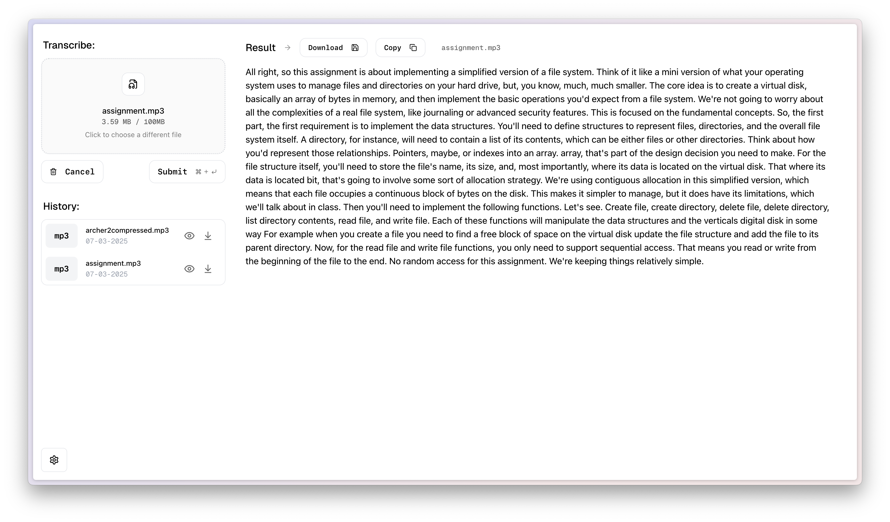
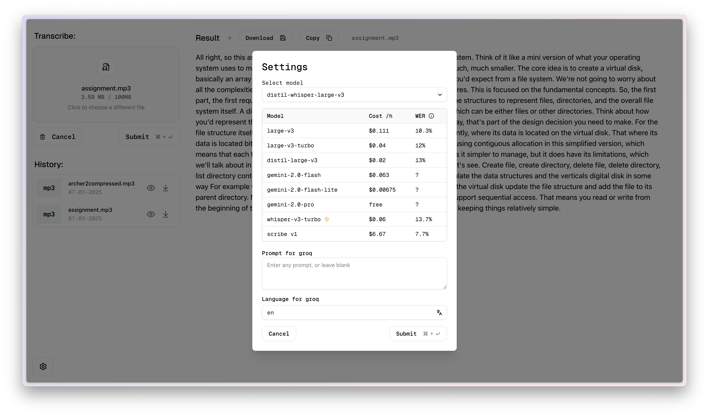

# Transcriptions

> a full stack web app built with Svelte, Tailwind, Flask that can be self hosted with docker compose, and offers a simple way to transcribe audio files

[](https://opensource.org/licenses/MIT)

### Features

- Supports 4 model providers:
  - `Groq` (inferencing OpenAI Whisper) - cheapest, medium speed, medium accuracy
  - `Google` (through gemini audio multimodality) - cheapest/medium price, slower speed, high accuracy
  - `FireworksAI` (inferencing OpenAI Whisper) - medium price, fastest speed, semi-high accuracy
  - `ElevenLabs` (in-house Scribe model) - most expensive, slowest speed, highest accuracy
- Saves a transcription history
- Saves settings between frontend visits
- Supports multiple audio file formats
- Supports multiple languages
- Supports multiple speaker diarization
- Can return word level or segment level timestamps
- BYOK - Bring your own keys

### Preview




### Setup

#### Option 1: Docker Setup (Recommended)

##### Prerequisites

- [Docker](https://www.docker.com/)
- [Docker Compose](https://docs.docker.com/compose/)

Clone the repository

```bash
git clone https://github.com/nocdn/transcriptions.git
cd transcription-svelte
```

Configure your API keys and settingsby copying the `.env.example` file to `.env` and filling it in with your own values.

```bash
cp .env.example .env
```

Build and start the Docker containers.

```bash
docker compose up -d --build
```

Depending on where you host it, the application will be available at `http://localhost:4090` or `http://[your-machine-ip]:4090`

##### Updating (if using Docker)

Stop the containers:

```bash
docker compose down
```

Pull the latest changes:

```bash
git pull
```

Build and start the Docker containers again:

```bash
docker-compose up -d --build
```


#### Option 2: Local Development

##### Prerequisites

You must have the following installed on your machine:

- [npm](https://www.npmjs.com/)
- [Python](https://www.python.org/)

Clone the repository:

```bash
git clone https://github.com/nocdn/transcriptions.git
```

Install the frontend dependencies:

```bash
cd transcriptions/frontend
npm install
```

From the same directory, start the front-end development server:

```bash
npm run dev
```

For the backend:

Configure your API keys and settings by copying the `.env.example` file to `.env` and filling it in with your own values.

```bash
cd transcriptions/backend
cp .env.example .env
```

In a new terminal, start the back-end development server:

```bash
cd transcriptions/backend
python -m venv venv
source venv/bin/activate
pip install -r requirements.txt
python app.py
```

### License

This project is licensed under the MIT License - see the [LICENSE](LICENSE) file for details
